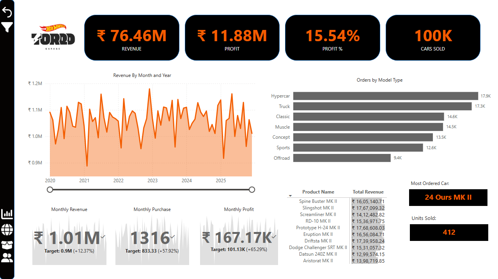
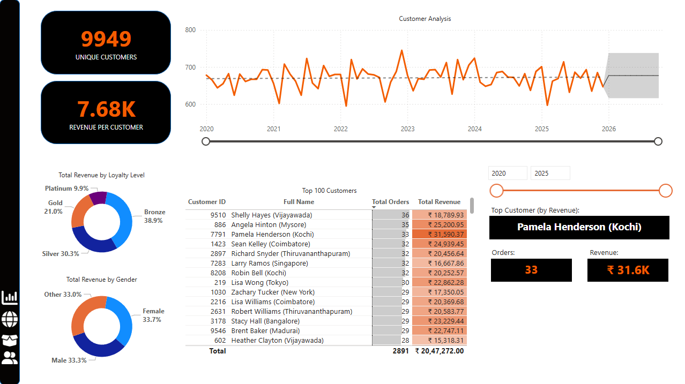
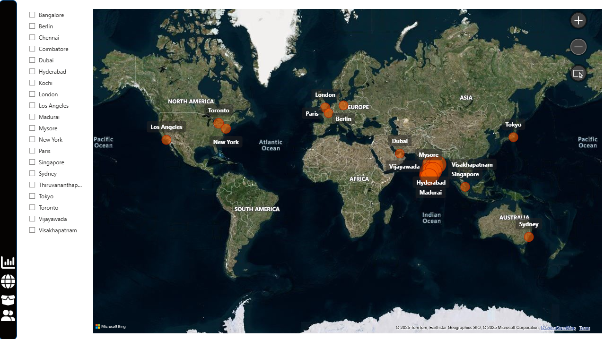
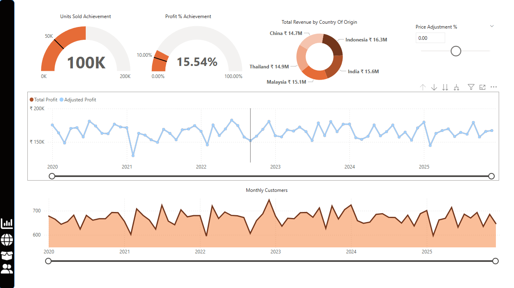

# Torqd Garage - Power BI Analytics Dashboard

A fictional end-to-end analytics project simulating collectible Hotwheels-style car sales in India. Built fully in Power BI using a custom star schema dataset generated via Python.

## 📊 Features:
- KPI dashboard with revenue, units sold, and churn indicators
- Advanced DAX: CALCULATE, SWITCH, row/filter context
- Custom visuals: cards, gauges, maps, matrices
- Simulated sales dataset with INR pricing & Indian customer profiles

## 📁 Files:
- `Torqd_Garage.pbix` - Power BI dashboard file
- `/datasets` - CSV files (Cars, Sales, Customers, Date)

## 📸 Dashboard Screenshots

### Executive Overview

### Customer Insights

### Geographic Distribution

### Profit & Performance Tracking

